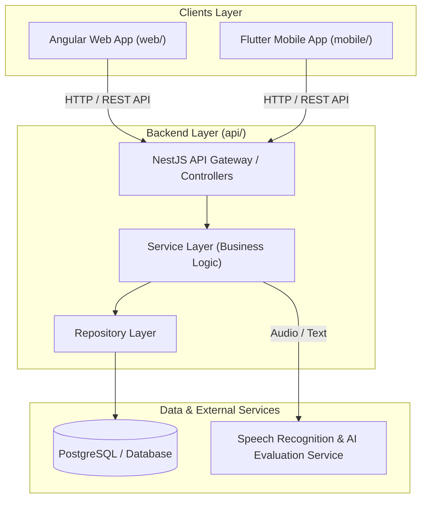
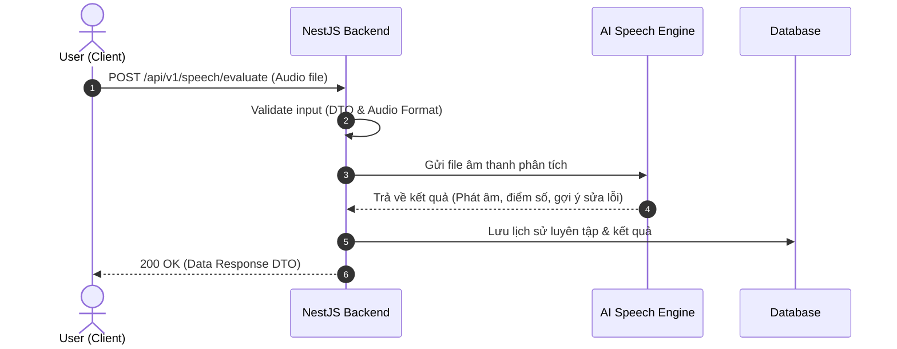

# 📊 Sơ đồ Kiến trúc Hệ thống

## 1. High-Level Architecture Diagram

```mermaid
graph TD
    subgraph Clients["Clients Layer"]
        WA["Angular Web App (web/)"]
        MA["Flutter Mobile App (mobile/)"]
    end

    subgraph Backend["Backend Layer (api/)"]
        GW["NestJS API Gateway / Controllers"]
        SVC["Service Layer (Business Logic)"]
        REPO["Repository Layer"]
    end

    subgraph Data["Data & External Services"]
        DB[(PostgreSQL / Database)]
        AI["Speech Recognition & AI Evaluation Service"]
    end

    WA -->|HTTP / REST API| GW
    MA -->|HTTP / REST API| GW
    GW --> SVC
    SVC --> REPO
    REPO --> DB
    SVC -->|Audio / Text| AI
```

## 2. Luồng dữ liệu Đánh giá phát âm (Speech Evaluation Flow)

```mermaid
sequenceDiagram
    autonumber
    actor User as User (Client)
    participant API as NestJS Backend
    participant AI as AI Speech Engine
    participant DB as Database

    User->>API: POST /api/v1/speech/evaluate (Audio file)
    API->>API: Validate input (DTO & Audio Format)
    API->>AI: Gửi file âm thanh phân tích
    AI-->>API: Trả về kết quả (Phát âm, điểm số, gợi ý sửa lỗi)
    API->>DB: Lưu lịch sử luyên tập & kết quả
    API-->>User: 200 OK (Data Response DTO)
```
