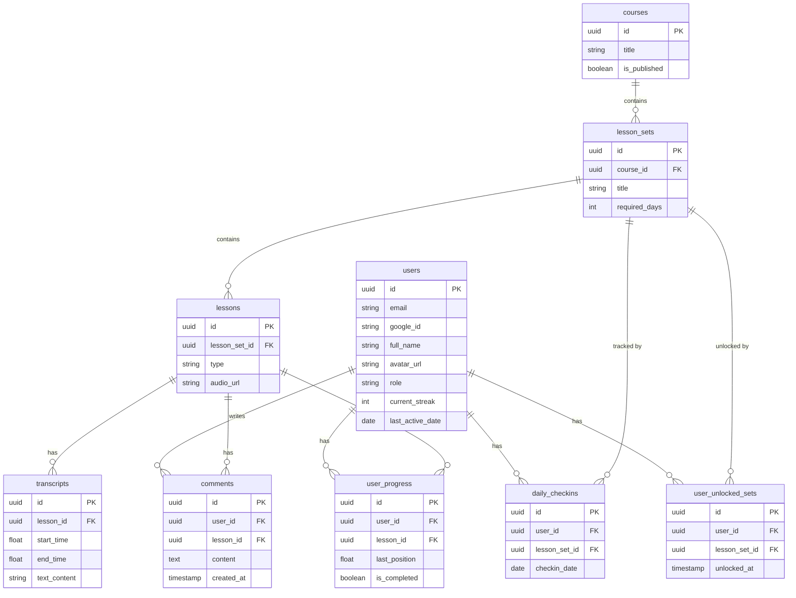

# Thiết kế Cơ sở dữ liệu (ERD)

Dựa trên phân tích Usecase, dưới đây là thiết kế Cơ sở dữ liệu cho hệ thống bằng PostgreSQL.

## 1. Sơ đồ thực thể kết nối (ER Diagram)

---

## 2. Từ điển dữ liệu chi tiết (Data Dictionary)

Dưới đây là mô tả chi tiết ý nghĩa của từng bảng và từng trường (column) trong cơ sở dữ liệu.

### 2.1. Bảng `users` (Người dùng)
Bảng lưu trữ thông tin người dùng, xác thực trực tiếp thông qua Google OAuth.
| Tên trường | Kiểu dữ liệu | Ràng buộc | Mô tả |
| :--- | :--- | :--- | :--- |
| `id` | `uuid` | PK | Khóa chính của người dùng. |
| `email` | `varchar` | Unique, Not Null| Địa chỉ email trả về từ Google. |
| `google_id` | `varchar` | Unique | ID định danh duy nhất (Subject ID) của người dùng do Google cung cấp. |
| `full_name` | `varchar` | | Họ và tên hiển thị của người dùng (từ Google profile). |
| `avatar_url` | `varchar` | | Đường dẫn (URL) tới ảnh đại diện (từ Google profile). |
| `role` | `enum` | Default: `LEARNER`| Phân quyền hệ thống. Gồm 2 giá trị: `LEARNER` (Học viên) và `ADMIN` (Quản trị viên). |
| `current_streak` | `int` | Default: `0` | **[Tối ưu]** Bộ đếm số ngày học liên tục hiện tại của user, giúp query nhanh trên Dashboard. |
| `last_active_date` | `date` | | Ngày cuối cùng user có hoạt động học tập, dùng để tính toán Streak cho ngày tiếp theo. |
| `created_at` | `timestamp`| Default: `now()`| Thời điểm tạo tài khoản lần đầu. |

### 2.2. Bảng `courses` (Khóa học)
Quản lý các khóa học lớn (Ví dụ: Original Effortless English, Power English).
| Tên trường | Kiểu dữ liệu | Ràng buộc | Mô tả |
| :--- | :--- | :--- | :--- |
| `id` | `uuid` | PK | Khóa chính. |
| `title` | `varchar` | Not Null | Tên khóa học. |
| `description` | `text` | | Mô tả chi tiết về khóa học. |
| `cover_image_url` | `varchar` | | Đường dẫn ảnh bìa của khóa học. |
| `is_published` | `boolean` | Default: `false`| Trạng thái hiển thị (True = Đã xuất bản cho học viên thấy, False = Đang soạn thảo/Ẩn). |
| `created_at` | `timestamp`| Default: `now()`| Thời điểm tạo. |

### 2.3. Bảng `lesson_sets` (Bộ bài học / Module)
Mỗi khóa học gồm nhiều "Set" (Ví dụ trong Original English có Set: A Kiss, Day of the Dead...).
| Tên trường | Kiểu dữ liệu | Ràng buộc | Mô tả |
| :--- | :--- | :--- | :--- |
| `id` | `uuid` | PK | Khóa chính. |
| `course_id` | `uuid` | FK | Thuộc về khóa học nào (`courses.id`). |
| `title` | `varchar` | Not Null | Tên bộ bài học (Ví dụ: "A Kiss"). |
| `description` | `text` | | Mục tiêu hoặc từ vựng chính của bộ bài học này. |
| `order_index` | `int` | | Thứ tự sắp xếp hiển thị của Set này trong Khóa học. |
| `required_days` | `int` | Default: `7` | **[Quan trọng]** Số ngày tối thiểu học viên phải luyện nghe Set này trước khi hệ thống cho phép mở khóa Set tiếp theo. |
| `created_at` | `timestamp`| Default: `now()`| Thời điểm tạo. |

### 2.4. Bảng `lessons` (Các bài học thành phần)
Mỗi Lesson Set thường chứa 3-4 file Audio tương ứng với các góc độ học khác nhau.
| Tên trường | Kiểu dữ liệu | Ràng buộc | Mô tả |
| :--- | :--- | :--- | :--- |
| `id` | `uuid` | PK | Khóa chính. |
| `lesson_set_id` | `uuid` | FK | Thuộc về Lesson Set nào. |
| `title` | `varchar` | Not Null | Tên bài học (VD: "A Kiss - Mini Story"). |
| `type` | `enum` | Not Null | Phân loại bài học: `MAIN` (Bài đọc chính), `VOCAB` (Từ vựng), `MINI_STORY` (Hỏi đáp), `POV` (Đổi thì ngữ pháp). |
| `audio_url` | `varchar` | Not Null | Link trỏ tới file MP3 lưu trên Supabase Storage (hoặc S3/GCS tương đương). |
| `duration_seconds`| `int` | | Tổng thời lượng của file âm thanh (tính bằng giây), dùng để hiển thị trên Player. |
| `order_index` | `int` | | Thứ tự hiển thị của bài học này trong 1 Set. |
| `created_at` | `timestamp`| Default: `now()`| Thời điểm tạo. |

### 2.5. Bảng `transcripts` (Lời thoại đồng bộ)
Lưu trữ lời thoại được cắt nhỏ theo thời gian (giống tính năng lời bài hát của Spotify).
| Tên trường | Kiểu dữ liệu | Ràng buộc | Mô tả |
| :--- | :--- | :--- | :--- |
| `id` | `uuid` | PK | Khóa chính. |
| `lesson_id` | `uuid` | FK | Lời thoại này của bài Audio nào. |
| `start_time` | `float` | Not Null | Mốc thời gian (giây) bắt đầu đọc câu này. |
| `end_time` | `float` | Not Null | Mốc thời gian (giây) kết thúc câu này. |
| `text_content` | `text` | Not Null | Nội dung đoạn tiếng Anh. |
| `order_index` | `int` | | Số thứ tự của câu từ trên xuống dưới. |

### 2.6. Bảng `user_progress` (Tiến độ nghe của học viên)
Lưu trạng thái học tập của một học viên đối với một bài nghe cụ thể.
| Tên trường | Kiểu dữ liệu | Ràng buộc | Mô tả |
| :--- | :--- | :--- | :--- |
| `id` | `uuid` | PK | Khóa chính. |
| `user_id` | `uuid` | FK | ID của học viên (`users.id`). |
| `lesson_id` | `uuid` | FK | ID của bài học (`lessons.id`). |
| `last_position` | `float` | Default: `0.0` | **[Tính năng Resume]** Lưu lại số giây cuối cùng người dùng đang nghe. Lần sau mở lại sẽ phát tiếp từ đây. |
| `is_completed` | `boolean` | Default: `false`| Trạng thái đã nghe hết bài này lần nào chưa. |
| `listen_count` | `int` | Default: `0` | Tổng số lần người dùng đã nghe trọn vẹn bài này. |
| `total_listen_time`| `int` | Default: `0` | Tổng số giây người dùng đã tiêu tốn cho bài này (bao gồm cả nghe đi nghe lại nhiều lần). |
| `last_listened_at`| `timestamp`| | Lần cuối cùng học viên bấm nghe bài này. |

### 2.7. Bảng `daily_checkins` (Theo dõi chuỗi ngày học sâu)
Hỗ trợ việc tính toán điều kiện `required_days` (Số ngày học bắt buộc) của Effortless English.
| Tên trường | Kiểu dữ liệu | Ràng buộc | Mô tả |
| :--- | :--- | :--- | :--- |
| `id` | `uuid` | PK | Khóa chính. |
| `user_id` | `uuid` | FK | ID của học viên (`users.id`). |
| `lesson_set_id` | `uuid` | FK | ID của bộ bài học đang được check-in. |
| `checkin_date` | `date` | Not Null | Ngày thực tế học viên có tương tác (nghe audio) thuộc Set này. Mỗi ngày chỉ ghi 1 dòng. Đếm số dòng này để xem đã đủ `required_days` chưa. |

### 2.8. Bảng `user_unlocked_sets` (Trạng thái mở khóa bài học)
Cache trạng thái mở khóa của một bộ bài học đối với một người dùng, giúp tăng tốc độ query ở màn hình danh sách thay vì phải tính toán lại dựa trên bảng `daily_checkins`.
| Tên trường | Kiểu dữ liệu | Ràng buộc | Mô tả |
| :--- | :--- | :--- | :--- |
| `id` | `uuid` | PK | Khóa chính. |
| `user_id` | `uuid` | FK | ID của học viên (`users.id`). |
| `lesson_set_id` | `uuid` | FK | ID của bộ bài học (`lesson_sets.id`). |
| `unlocked_at` | `timestamp`| Default: `now()`| Thời điểm bộ bài học này chính thức được mở khóa. |

### 2.9. Bảng `comments` (Bình luận / Thảo luận)
Cho phép người dùng thảo luận bên dưới mỗi bài học cụ thể, tạo tính cộng đồng.
| Tên trường | Kiểu dữ liệu | Ràng buộc | Mô tả |
| :--- | :--- | :--- | :--- |
| `id` | `uuid` | PK | Khóa chính. |
| `user_id` | `uuid` | FK | ID của người bình luận (`users.id`). |
| `lesson_id` | `uuid` | FK | Bình luận thuộc về bài học nào (`lessons.id`). |
| `content` | `text` | Not Null | Nội dung bình luận. |
| `created_at` | `timestamp`| Default: `now()`| Thời điểm bình luận. |
