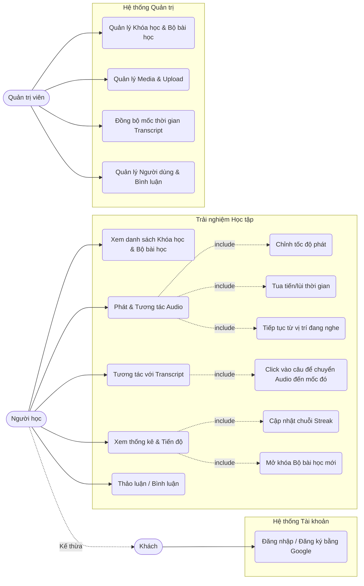

# Sơ đồ Usecase (Usecase Diagram)

Dựa trên các yêu cầu từ file phân tích nghiệp vụ, dưới đây là sơ đồ Usecase cho hệ thống website học tiếng Anh Effortless English.

## 1. Biểu đồ Usecase (Sử dụng Mermaid)

## 2. Chi tiết các Usecase Chính

### 2.1. Phía Người học (Learner)
*   **Phát & Tương tác Audio:** Đây là usecase cốt lõi. Người dùng sẽ sử dụng audio player chuyên dụng với khả năng tùy chỉnh tốc độ, tua audio để phản xạ nhanh trong các bài Mini-Story, và hệ thống tự lưu mốc thời gian để họ nghe tiếp khi quay lại.
*   **Tương tác với Transcript:** Người dùng đọc văn bản chạy đồng bộ với audio và có thể chủ động bấm vào đoạn văn bản chưa nghe rõ để audio lùi đúng về câu đó.
*   **Xem thống kê & Tiến độ:** Người dùng theo dõi Streak học liên tục, số giờ nghe, đồng thời hệ thống tự động kiểm tra điều kiện (nghe 7 ngày/set) trước khi cho phép họ mở khóa bài mới.
*   **Thảo luận / Bình luận:** Người dùng có thể để lại bình luận dưới mỗi bài học, tương tác và đặt câu hỏi để kết nối với cộng đồng người học khác.

### 2.2. Phía Quản trị viên (Admin)
*   **Quản lý Khóa học & Bộ bài học:** Tạo các course như Original, Power English, sau đó tạo các Lesson Set (bài học) bên trong.
*   **Quản lý Media & Upload:** Tải âm thanh (mp3) lên hệ thống lưu trữ (Supabase Storage).
*   **Đồng bộ mốc thời gian Transcript:** Công cụ riêng giúp Admin ghép mốc thời gian (timestamp) vào văn bản một cách dễ dàng, giúp tính năng Interactive Transcript hoạt động.
*   **Quản lý Người dùng & Bình luận:** Theo dõi, phân quyền tài khoản người dùng và kiểm duyệt các bình luận trong hệ thống.
