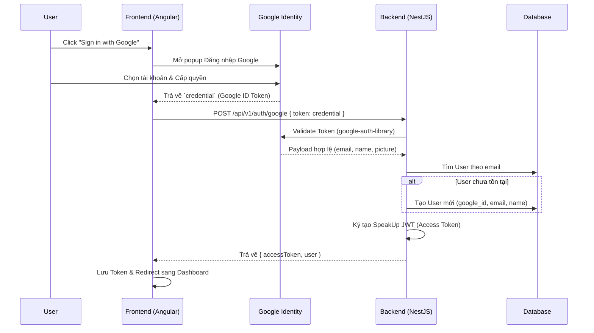

# Tính năng Đăng nhập với Google (Google OAuth2)

## 1. Mô tả chung (Overview)
- **Mục tiêu:** Cung cấp chức năng Đăng nhập/Đăng ký nhanh (SSO) thông qua tài khoản Google.
- **Phạm vi (Scope):** 
  - Hiển thị nút "Sign in with Google" chuẩn của Google Identity Services ở Frontend.
  - Xác thực ID Token của Google tại Backend và tạo tài khoản Học viên nội bộ.
  - Sinh ra JWT Access Token của hệ thống SpeakUp.
- **Đối tượng (Actors):** Người dùng vãng lai (Guest).

## 2. Luồng nghiệp vụ (User Flow)



## 3. Phân tích thiết kế (Technical Design)

### 3.1. Thiết kế Giao diện (Frontend - Angular)
- Sử dụng API **Google Identity Services (GIS)** (chèn thẻ script `https://accounts.google.com/gsi/client`) thay vì dùng thư viện bên thứ 3 để đảm bảo chuẩn nhất và nhẹ nhất.
- Render nút "Sign in with Google" vào thẻ `div` trong `LoginComponent`.
- Xử lý Callback khi Google trả về `credential`.
- Gọi API Backend `POST /auth/google`.

### 3.2. Thiết kế API (Backend - NestJS)
- **Thư viện:** `google-auth-library`, `@nestjs/jwt`, `@nestjs/passport`, `passport-jwt`.
- **Database ORM:** Sử dụng **Prisma** (kết nối PostgreSQL) để thao tác Database mạnh mẽ, an toàn và dễ debug.
- **API Endpoint:** `POST /api/v1/auth/google`.
- **Logic Backend:**
  1. Dùng `OAuth2Client.verifyIdToken(token)` để xác minh token do Frontend gửi lên là chuẩn của Google.
  2. Lấy `email`, `sub` (googleId), `name`, `picture` từ payload.
  3. Tìm (findUnique) hoặc Tạo (create) User trong Database qua Prisma.
  4. Trả về Access Token (JWT) của NestJS.

## 4. Thiết kế Cơ sở dữ liệu (Prisma Schema)

```prisma
model User {
  id           String   @id @default(uuid())
  email        String   @unique
  googleId     String?  @unique
  fullName     String?
  avatarUrl    String?
  passwordHash String?  // Nullable vì dùng Google Login
  createdAt    DateTime @default(now())
  updatedAt    DateTime @updatedAt
}
```

## 5. Các bước triển khai (Implementation Plan)
1. Khởi tạo `docker-compose.yml` để chạy PostgreSQL cục bộ.
2. Cài đặt Prisma, tạo schema và migrate Database.
3. Cài đặt module Auth, JWT, Google Auth Library ở Backend.
4. Cài đặt Google Identity Services ở Frontend.
5. Hướng dẫn lấy `GOOGLE_CLIENT_ID` trên Google Cloud Console để dán vào `.env`.
