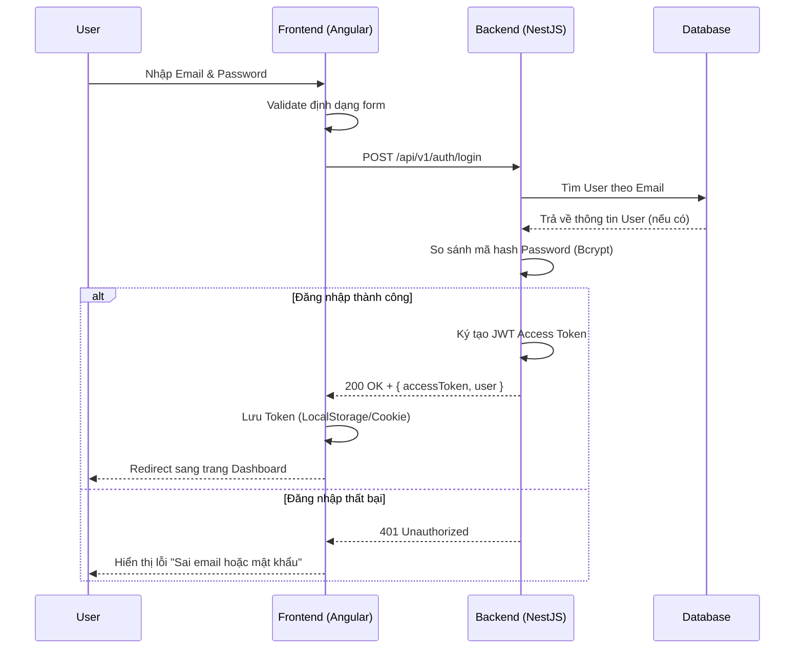
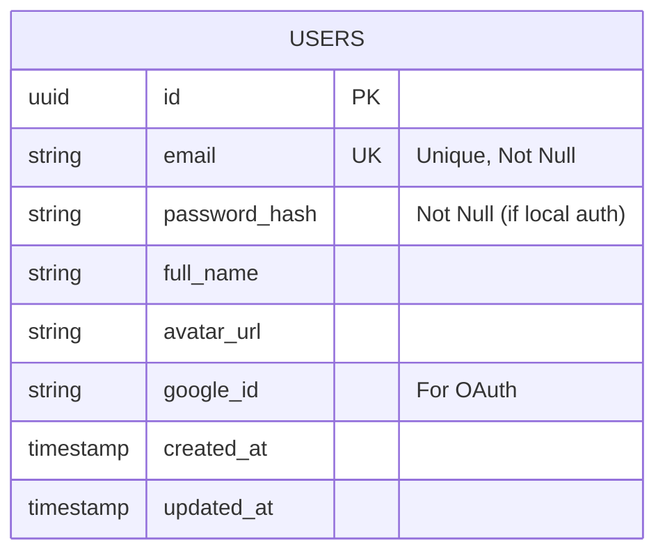

# Tính năng Xác thực (Authentication)

## 1. Mô tả chung (Overview)
- **Mục tiêu:** Cung cấp chức năng cho phép người dùng đăng ký tài khoản mới và đăng nhập vào hệ thống để bắt đầu quá trình học tiếng Anh.
- **Phạm vi (Scope):** 
  - Đăng nhập / Đăng ký bằng Email & Password.
  - Xử lý mã hoá mật khẩu và cấp phát JWT (JSON Web Token).
  - (Phase sau) Đăng nhập bằng Google OAuth.
- **Đối tượng (Actors):** Người dùng vãng lai (Guest) -> Trở thành Học viên (User).

## 2. Luồng nghiệp vụ (User Flow)

## 3. Phân tích thiết kế (Technical Design)

### 3.1. Thiết kế Giao diện (Frontend - Angular)
- **Component:** `LoginComponent` (Đã xây dựng UI) cần tích hợp thêm `ReactiveFormsModule` để quản lý form data và validation.
- **Service:** `AuthService` chứa các hàm `login(credentials)`, `register(data)`, `logout()`.
- **State Management / Storage:** Lưu JWT vào `localStorage` (hoặc HttpOnly Cookie) và thêm `AuthInterceptor` để tự động đính kèm token vào Header của mọi request gửi lên Backend.
- **Routing:** Thêm Route Guard (`AuthGuard`) để bảo vệ các trang yêu cầu đăng nhập (như Dashboard).

### 3.2. Thiết kế API (Backend - NestJS)
- **Modules cần cài đặt:** `@nestjs/jwt`, `@nestjs/passport`, `passport-jwt`, `bcrypt`.
- **Controllers & Endpoints:**
  - `POST /api/v1/auth/register`: Đăng ký tài khoản (Tạo user mới, hash password).
  - `POST /api/v1/auth/login`: Đăng nhập (Trả về JWT).
  - `GET /api/v1/auth/me`: Lấy thông tin user hiện tại (Dùng `JwtAuthGuard`).
- **Services:** `AuthService` (Xử lý JWT, validate password), `UsersService` (Thao tác với CSDL).

## 4. Thiết kế Cơ sở dữ liệu (Database Schema)

## 5. Xử lý ngoại lệ (Edge Cases & Error Handling)
- **Frontend:** 
  - Khóa (Disable) nút Submit khi form đang loading để tránh click nhiều lần.
  - Cảnh báo người dùng nếu nhập sai định dạng email hoặc password quá ngắn (dưới 6 ký tự).
- **Backend:** 
  - Trả về mã lỗi `400 Bad Request` nếu thiếu payload.
  - Trả về mã lỗi `409 Conflict` nếu email đã tồn tại khi đăng ký.
  - Không bao giờ trả chi tiết lỗi cụ thể là "Sai email" hay "Sai mật khẩu", chỉ trả chung chung "Thông tin đăng nhập không hợp lệ" để bảo mật.

## 6. Checklist (Definition of Done)
- [ ] Phân tích thiết kế xong
- [ ] Khởi tạo Module, Controller, Service cho Auth ở NestJS
- [ ] Tích hợp TypeORM/Prisma để tạo bảng Users
- [ ] Viết logic Hash Password và JWT
- [ ] Code chức năng Form Login/Register ở Angular
- [ ] Tích hợp API vào UI và xử lý lưu Token
- [ ] Test toàn bộ luồng đăng ký -> đăng nhập -> xem dashboard
