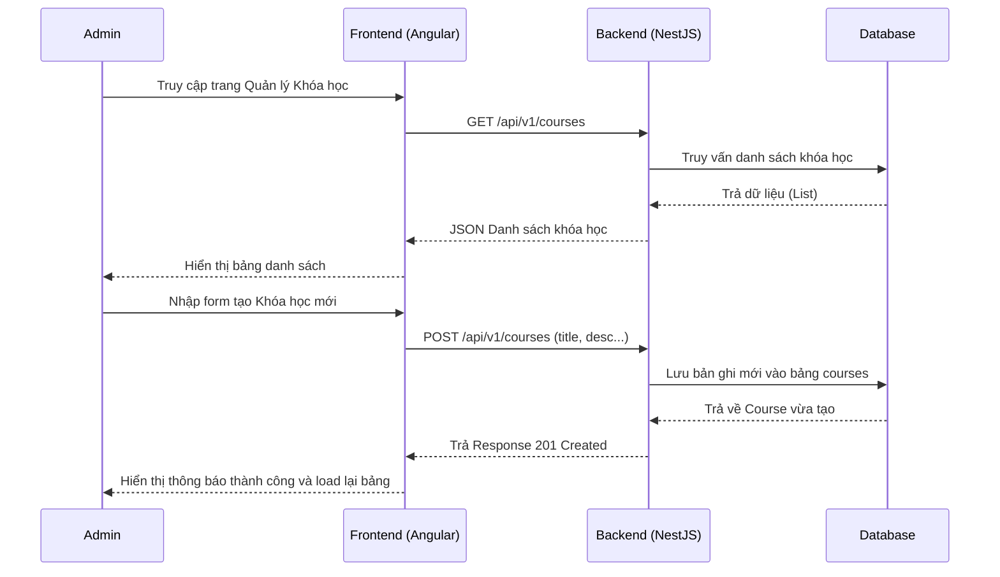
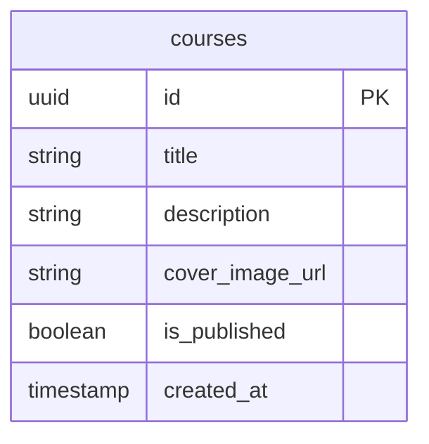

# Quản lý Khóa học (Admin Course Management)

## 1. Mô tả chung (Overview)
- **Mục tiêu:** Cho phép Quản trị viên (Admin) xem, thêm, sửa, xóa các khóa học lớn (Ví dụ: Original English, Power English) trong hệ thống. Đây là dữ liệu nền tảng để học viên có thể học tập.
- **Phạm vi (Scope):** Tính năng này chỉ tập trung vào CRUD bảng `courses`. Các module cấp dưới như `lesson_sets` và `lessons` sẽ nằm ở một phase quản lý chi tiết khác.
- **Đối tượng (Actors):** Hệ thống chỉ cấp quyền cho tài khoản có role `ADMIN`.

## 2. Luồng nghiệp vụ (User Flow)

## 3. Phân tích thiết kế (Technical Design)

### 3.1. Thiết kế Giao diện (Frontend)
- **Các Component cần xây dựng:** 
  - `AdminCourseListComponent`: Hiển thị danh sách khóa học dạng bảng (Table) hoặc dạng thẻ (Card) kết hợp với các nút hành động (Edit, Delete, Toggle Publish).
  - `AdminCourseFormComponent`: Một Modal hoặc một trang riêng để nhập liệu (Title, Description, Cover Image URL, isPublished).
- **State Management:** Xây dựng `CourseService` để chứa trạng thái danh sách khóa học hiện tại.
- **Routing:** `/admin/courses`

### 3.2. Thiết kế API (Backend)
- **Các API Endpoints:**
  - `GET /api/v1/courses`: Lấy toàn bộ danh sách khóa học.
  - `GET /api/v1/courses/:id`: Lấy chi tiết 1 khóa học.
  - `POST /api/v1/courses`: Tạo khóa học mới.
  - `PUT /api/v1/courses/:id`: Cập nhật thông tin khóa học.
  - `DELETE /api/v1/courses/:id`: Xóa khóa học.
- **Services / Modules cần thêm:** Khởi tạo `CoursesModule` trong NestJS.

## 4. Thiết kế Cơ sở dữ liệu (Database Schema)
Tính năng này tương tác trực tiếp với bảng `courses` đã có sẵn trong `schema.prisma`.

## 5. Xử lý ngoại lệ (Edge Cases & Error Handling)
- **Xóa Khóa học đang có người học:** Vì CSDL có gài chế độ `OnDelete: Cascade`, việc xóa khóa học sẽ xóa sạch mọi bài học con và tiến trình học. Cần hiển thị **cảnh báo xác nhận** (Confirm Dialog) bằng chữ đỏ 2 lần ở FE trước khi cho phép gọi API DELETE.
- **Tên khóa học để trống:** API phải chặn lỗi bằng ValidationPipe và DTO (NestJS), FE cũng phải có Validation Form.

## 6. Checklist (Definition of Done)
- [ ] Phân tích thiết kế xong
- [ ] Thiết kế Database (Đã xong)
- [ ] Code Backend API (NestJS CRUD) & Test
- [ ] Code Frontend UI (Admin Table & Form)
- [ ] Ghép API vào Frontend
- [ ] Hoàn thành & Kiểm thử thành công
