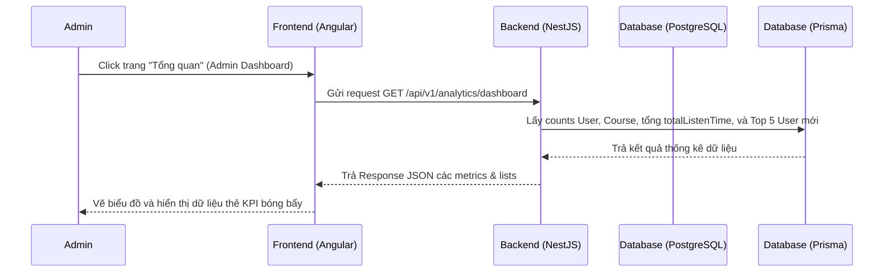

# Quản lý Tổng quan cho Quản trị viên (Admin Dashboard)

## 1. Mô tả chung (Overview)
- **Mục tiêu:** Cung cấp cho Quản trị viên (Admin) một trang tổng quan ("Tháp điều khiển") để theo dõi toàn bộ trạng thái hoạt động của hệ thống SpeakUp bao gồm: số lượng học viên, mức độ tương tác, khối lượng bài học, xu hướng học tập, và các hoạt động đăng ký/cập nhật nội dung gần đây.
- **Phạm vi (Scope):**
  - Backend: Viết thêm API Endpoint `/api/v1/analytics/dashboard` tổng hợp dữ liệu thống kê thật từ database qua Prisma.
  - Frontend: Thiết kế giao diện `AdminHomeComponent` theo phong cách Glassmorphism đồng nhất với hệ thống, hiển thị các thẻ chỉ số KPI, biểu đồ xu hướng hoạt động học tập, top khóa học phổ biến và danh sách học viên mới.
- **Đối tượng (Actors):** Admin (Quản trị viên hệ thống).

## 2. Luồng nghiệp vụ (User Flow)
Mô tả cách thức Admin truy cập và hệ thống truy xuất dữ liệu hiển thị biểu đồ:

## 3. Phân tích thiết kế (Technical Design)

### 3.1. Thiết kế Giao diện (Frontend)
- **Component chỉnh sửa:**
  - `AdminHomeComponent` tại [admin-home.component.ts](file:///d:/HocTap/MyPortfolio/speak-up/source/frontend/src/app/pages/admin/home/admin-home/admin-home.component.ts).
  - Tải động dữ liệu bằng cách sử dụng `HttpClient` để gọi API Backend.
- **Styling:** [admin-home.component.scss](file:///d:/HocTap/MyPortfolio/speak-up/source/frontend/src/app/pages/admin/home/admin-home/admin-home.component.scss) áp dụng nền glassmorphism, hiệu ứng hover, layout dạng lưới grid responsive.
- **Routing:** Khai báo trỏ vào `AdminHomeComponent` tại tuyến đường `/admin` trong `admin-routing.module.ts` hoặc `app.routes.ts`.

### 3.2. Thiết kế API (Backend)
Tạo mới module `AnalyticsModule` chứa:
- **API Endpoint:**
  - `GET /api/v1/analytics/dashboard`: Tổng hợp dữ liệu hiển thị Dashboard bao gồm:
    - `kpis`: `{ totalLearners: number, activeLearners24h: number, totalCourses: number, totalStudyTimeMinutes: number }`
    - `recentSignups`: Danh sách 5 người dùng mới (`id`, `fullName`, `email`, `avatarUrl`, `createdAt`).
    - `popularCourses`: Danh sách 3 khóa học hàng đầu có lượng progress học viên tương tác cao nhất.
    - `learningActivity`: Biểu đồ học tập giả lập theo tuần.
- **Services / Modules cần thêm:**
  - `AnalyticsModule`, `AnalyticsController`, `AnalyticsService`.

## 4. Thiết kế Cơ sở dữ liệu (Database Schema)
Sử dụng các bảng hiện có trong database:
*   Bảng `users` để đếm tổng học viên (`role = 'LEARNER'`) và lấy danh sách đăng ký gần đây.
*   Bảng `courses` để đếm tổng số khóa học.
*   Bảng `user_progress` để tính tổng số phút học tích lũy thông qua trường `totalListenTime`.

---

## 5. Xử lý ngoại lệ (Edge Cases & Error Handling)
- **Không có dữ liệu tiến độ:** Khi hệ thống mới chạy chưa có ai học, `totalStudyTime` trả về `0`, các biểu đồ hiển thị trạng thái mặc định chứ không bị crash.
- **Lỗi xác thực (Unauthorized):** API `/analytics/dashboard` được bảo vệ bởi `AuthGuard` và `RolesGuard` đảm bảo chỉ người có vai trò `ADMIN` mới gọi được.

## 6. Checklist (Definition of Done)
- [ ] Phân tích thiết kế xong
- [ ] Code Backend Analytics Module (Service + Controller)
- [ ] Tích hợp Analytics Module vào AppModule của NestJS
- [ ] Viết giao diện HTML/SCSS cho AdminHomeComponent (FE)
- [ ] Tích hợp gọi API Backend từ Frontend và vẽ giao diện
- [ ] Hoàn thành & Kiểm thử thành công
