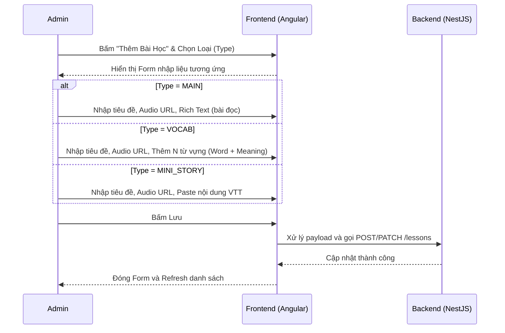
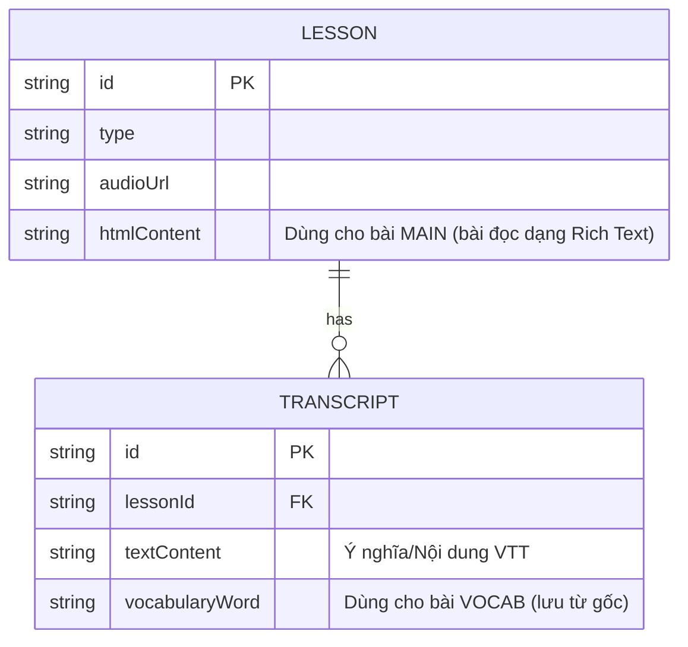

# Quản Lý Nội Dung Bài Học (Admin Lesson Management) theo Phân Loại

## 1. Mô tả chung (Overview)
- **Mục tiêu:** Cung cấp giao diện trực quan và chuyên biệt cho Admin khi nhập liệu các loại bài học khác nhau (MAIN, VOCAB, MINI_STORY, POV). Tránh việc sử dụng một form nhập liệu chung chung không đáp ứng đủ nhu cầu nghiệp vụ của hệ thống Effortless English.
- **Phạm vi (Scope):** 
  - Xây dựng 3 dạng màn hình/modal nhập liệu riêng biệt tùy theo `LessonType`.
  - Hỗ trợ nhập Rich Text (bôi đậm từ mới) cho bài MAIN.
  - Hỗ trợ thêm/xóa từng từ vựng động cho bài VOCAB.
  - Hỗ trợ Upload/Paste file VTT cho bài MINI_STORY/POV để tự động bóc tách thành Transcript.
- **Đối tượng (Actors):** ADMIN.

## 2. Luồng nghiệp vụ (User Flow)

## 3. Phân tích thiết kế (Technical Design)

### 3.1. Thiết kế Giao diện (Frontend)
- **Cấu trúc Component:** Nên chuyển từ 1 modal khổng lồ trong `CourseDetailComponent` thành các sub-components riêng biệt (ví dụ: `LessonMainFormComponent`, `LessonVocabFormComponent`, `LessonStoryFormComponent`).
- **Xử lý Text:** 
  - Bài MAIN: Cần nhúng một Rich Text Editor nhẹ (ví dụ: Quill hoặc ngx-editor) để có thể bôi đậm (Bold) các cụm từ mới.
  - Bài VOCAB: Dùng `FormArray` (Reactive Forms) để quản lý danh sách từ mới (có nút `+ Thêm từ` và `- Xóa`).
  - Bài MINI_STORY: Dùng một Textarea lớn để paste chuỗi VTT. Cần có hàm Parser ở Frontend hoặc Backend để bóc tách VTT thành mảng `transcripts { startTime, endTime, textContent }`.

### 3.2. Thiết kế API (Backend)
- **API Endpoints:**
  - `POST /lessons` & `PATCH /lessons/:id`: Payload gửi lên sẽ đa dạng hơn.
  - **Lưu ý nghiệp vụ:** Khi lưu bài MAIN có text, text có thể được chuyển đổi thành 1 transcript duy nhất bao trùm độ dài Audio, HOẶC lưu vào một cột `htmlContent` mới trong bảng `Lesson`.

## 4. Thiết kế Cơ sở dữ liệu (Database Schema)
Cần bổ sung một vài trường vào schema hiện tại để lưu trữ nội dung đặc thù:

*Đánh giá:* 
- Với bài MAIN: Lưu HTML vào trường `htmlContent` của `Lesson`.
- Với bài VOCAB: Sử dụng bảng `Transcript` nhưng cần bổ sung trường (ví dụ tách `vocabularyWord` và dùng `textContent` cho ý nghĩa).
- Với bài MINI_STORY: Đã hoàn toàn tương thích với bảng `Transcript` hiện tại.

## 5. Xử lý ngoại lệ (Edge Cases & Error Handling)
- Lỗi định dạng VTT: Khi Admin paste VTT không đúng chuẩn (thiếu `-->`, sai định dạng time), Frontend phải Validate bằng Regex và báo lỗi ngay.
- Validation: Audio URL là bắt buộc cho tất cả các loại bài học.

## 6. Checklist (Definition of Done)
- [ ] Phân tích thiết kế xong
- [ ] Cập nhật Database Schema (thêm `htmlContent` cho Lesson, tách cột cho Transcript nếu cần)
- [ ] Code Backend API & Test
- [ ] Code UI Form nhập liệu MAIN (Rich Text)
- [ ] Code UI Form nhập liệu VOCAB (Dynamic List)
- [ ] Code UI Form nhập liệu MINI_STORY (VTT Parser)
- [ ] Ghép API vào Frontend
- [ ] Hoàn thành & Kiểm thử thành công
