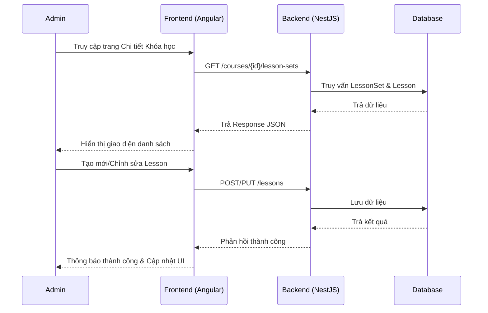
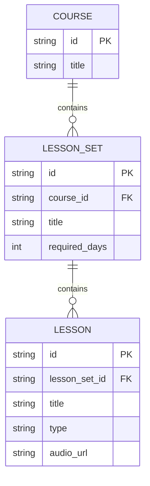

# Quản lý Bộ bài học & Bài học (Admin Lesson Management)

## 1. Mô tả chung (Overview)
- **Mục tiêu:** Cho phép Admin tạo, sửa, xóa các "Bộ bài học" (LessonSet) và các "Bài học" (Lesson) bên trong một Khóa học cụ thể. Từ đó cấu trúc hóa nội dung học tập một cách logic (ví dụ: Day 1 gồm Audio Chính, Từ vựng, Mini Story).
- **Phạm vi (Scope):** 
  - CRUD Bộ bài học (LessonSet) gắn với 1 Course.
  - CRUD Bài học (Lesson) gắn với 1 LessonSet.
  - Giao diện Admin để quản lý trực quan nội dung này.
  - Tải lên đường dẫn Audio URL cho các bài học MP3.
- **Đối tượng (Actors):** Admin.

## 2. Luồng nghiệp vụ (User Flow)

## 3. Phân tích thiết kế (Technical Design)

### 3.1. Thiết kế Giao diện (Frontend)
- **Các Component cần xây dựng:**
  - `CourseDetailComponent` (Đóng vai trò là Container hiển thị cấu trúc Khóa học).
  - `LessonSetListComponent` / Accordion (Hiển thị danh sách các Set).
  - `LessonSetFormComponent` (Modal tạo/sửa Bộ bài học).
  - `LessonFormComponent` (Modal tạo/sửa Bài học, chọn Loại bài học, nhập URL MP3).
- **Routing:** `/admin/courses/:id`

### 3.2. Thiết kế API (Backend)
- **Các API Endpoints:**
  - `GET /courses/:id`: Lấy chi tiết Course kèm các LessonSet và Lesson (dùng cho hiển thị nhanh). Hoặc `GET /courses/:id/lesson-sets` lấy danh sách Set.
  - `POST /lesson-sets`: Tạo LessonSet mới (cần `courseId`).
  - `PUT /lesson-sets/:id`: Cập nhật LessonSet.
  - `DELETE /lesson-sets/:id`: Xóa LessonSet.
  - `POST /lessons`: Tạo Lesson mới (cần `lessonSetId`, `type`, `audioUrl`, `title`).
  - `PUT /lessons/:id`: Cập nhật Lesson.
  - `DELETE /lessons/:id`: Xóa Lesson.

## 4. Thiết kế Cơ sở dữ liệu (Database Schema)
(Dựa trên Schema Prisma đã định nghĩa sẵn)

## 5. Xử lý ngoại lệ (Edge Cases & Error Handling)
- **Ràng buộc khóa ngoại:** Không thể tạo LessonSet nếu `courseId` không tồn tại.
- **Xóa Cascade:** Xóa Khóa học sẽ xóa toàn bộ LessonSet, xóa LessonSet sẽ xóa toàn bộ Lesson bên trong (Đã config Cascade trong Prisma).
- **Kiểu bài học (LessonType):** Phải được validate đúng Enum (MAIN, VOCAB, MINI_STORY, POV).
- **URL MP3 không hợp lệ:** Có regex kiểm tra định dạng URL cơ bản ở FE.
