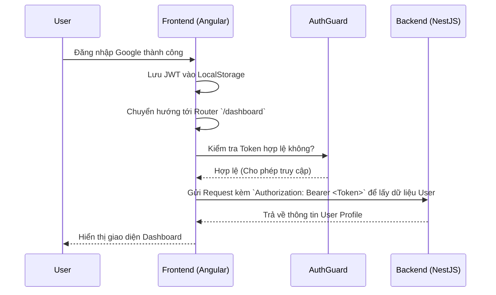

# Trang Dashboard (Bảng điều khiển học tập)

## 1. Mô tả chung (Overview)
- **Mục tiêu:** Tạo ra một "Trạm trung chuyển" (Hub) chính cho Học viên sau khi đăng nhập thành công. Đây là nơi học viên bao quát được tiến độ học tập, bắt đầu các bài luyện nói tiếng Anh với AI, và xem thống kê cá nhân.
- **Phạm vi (Scope):** 
  - Giao diện Sidebar điều hướng (Menu trái).
  - Thanh Topbar (Hiển thị Avatar, Tên người dùng lấy từ Token).
  - Khu vực hiển thị thông điệp chào mừng ("Welcome back, [Name]").
  - Các khối Card (Glassmorphism) để truy cập nhanh vào bài học/phòng chat AI.
- **Đối tượng (Actors):** Học viên (Đã đăng nhập).

## 2. Luồng nghiệp vụ (User Flow)

## 3. Phân tích thiết kế (Technical Design)

### 3.1. Thiết kế Giao diện (Frontend)
- **Các Component cần xây dựng:** 
  - `DashboardLayoutComponent`: Layout bọc ngoài chứa Sidebar và Topbar.
  - `DashboardHomeComponent`: Nội dung chính của trang Dashboard.
  - `SidebarComponent`: Thanh menu điều hướng.
- **State Management:**
  - Cập nhật `AuthService` để có hàm `getCurrentUser()` giải mã JWT Token lấy tên và ảnh đại diện hiển thị lên Topbar.
- **Logic Trải nghiệm Cá nhân hóa (Personalization):**
  - Banner chào mừng (Hero Banner) có khả năng tính toán thời gian thực (Real-time) để hiển thị lời chào tương ứng:
    - `05:00 - 11:59`: "Good morning" (Nền xanh dương).
    - `12:00 - 17:59`: "Good afternoon" (Nền vàng cam nắng chiều).
    - `18:00 - 04:59`: "Good evening" (Nền xanh tím than đêm tối).
- **Routing:** 
  - `path: 'dashboard'` (Được bảo vệ bởi `AuthGuard`).
- **Aesthetics (Thẩm mỹ):** Kế thừa phong cách Dark Mode, Glassmorphism, đổ bóng neon tinh tế và hiệu ứng hover mượt mà.

### 3.2. Thiết kế API (Backend)
- **Các API Endpoints:**
  - `GET /api/v1/auth/profile`: (Tùy chọn) Lấy thông tin user chi tiết từ DB dựa vào JWT Token. Hiện tại JWT đã có sẵn Email, Name, Avatar nên có thể dùng luôn không cần gọi API này ngay lập tức.
- **Bảo mật:** Tạo `JwtAuthGuard` ở Backend để chặn các truy cập không có Token.

## 4. Thiết kế Cơ sở dữ liệu (Database Schema)
*Chưa cần thay đổi Schema ở phase này vì ta chỉ đang hiển thị dữ liệu từ bảng User đã có.*

## 5. Xử lý ngoại lệ (Edge Cases & Error Handling)
- **Trường hợp chưa đăng nhập / Token hết hạn:** `AuthGuard` ở Frontend sẽ tự động đá người dùng về trang `/login` với thông báo "Phiên đăng nhập hết hạn".
- **Trạng thái Loading:** Hiển thị Skeleton Loading khi đang chờ render component.

## 6. Checklist (Definition of Done)
- [ ] Phân tích thiết kế xong
- [ ] Tạo file mô tả tính năng (dashboard.md)
- [ ] Khởi tạo Layout & Route `/dashboard`
- [ ] Viết `AuthGuard` để bảo vệ Route
- [ ] Thiết kế UI Sidebar, Topbar, Main Content (Chuẩn Aesthetic)
- [ ] Đổ dữ liệu thật từ JWT (Tên, Avatar) lên giao diện
- [ ] Hoàn thành & Kiểm thử thành công
