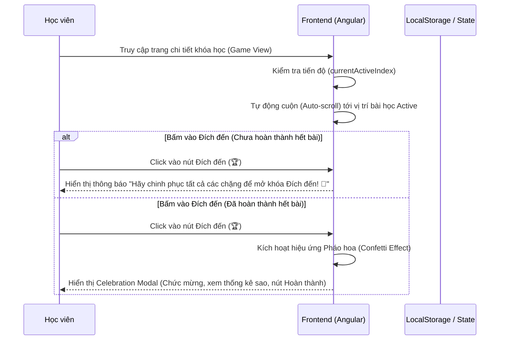

# Nâng cấp Bản đồ Game (Game View Enhancement)

## 1. Mô tả chung (Overview)
- **Mục tiêu:** Nâng cấp trải nghiệm người dùng trên màn hình bản đồ lộ trình học (Game View) của khóa học, giải quyết 2 vấn đề:
  1. Hướng hiển thị bản đồ và tối ưu hóa việc cuộn màn hình (không để người dùng phải vuốt mỏi tay tìm bài học).
  2. Tạo điểm nhấn ở Đích đến (Finish Line) để chúc mừng, vinh danh học viên khi hoàn thành khóa học, tránh cảm giác hụt hẫng.
- **Phạm vi (Scope):**
  - Giữ nguyên hướng đi của bản đồ từ Trên xuống dưới (Top-to-Bottom) vì đây là hướng tối ưu nhất trên giao diện web (bài 1 ở trên cùng, đích ở dưới cùng, người dùng đọc từ trên xuống dưới một cách tự nhiên).
  - Tích hợp tính năng **Auto-scroll to Active Node**: Tự động cuộn mượt mà vùng bản đồ đến vị trí của bài học đang hoạt động (`active`) ngay khi trang được tải hoặc khi chuyển sang Game View.
  - Tích hợp tính năng **Đích đến Tương tác (Interactive Finish Line)**:
    - Nếu chưa hoàn thành tất cả các bài học: Nhấp vào Đích đến sẽ hiển thị một Toast/Bong bóng thông báo khuyến khích học viên chinh phục hết các chặng.
    - Nếu đã hoàn thành tất cả các bài học (tất cả các set đều đã hoàn thành): Cho phép nhấp vào để hiển thị một **Modal Chúc mừng (Celebration Modal)** hoành tráng với cúp vàng, pháo hoa (Confetti) bay lượn và nút hoàn thành khóa học.
- **Đối tượng (Actors):** Học viên (Learner).

## 2. Luồng nghiệp vụ (User Flow)

## 3. Phân tích thiết kế (Technical Design)

### 3.1. Thiết kế Giao diện (Frontend)
- **Các Component cần chỉnh sửa:**
  - `LearnerCourseDetailComponent` (`learner-course-detail.component.ts` & `.html` & `.scss`):
    - Thêm biến state `showCelebrationModal` (boolean) để hiển thị/ẩn Modal chúc mừng.
    - Thêm mảng `confettiParticles` để quản lý các hạt pháo hoa bay trên màn hình (CSS animation).
    - Thêm logic kiểm tra xem khóa học đã được hoàn thành chưa (`isCourseCompleted`).
    - Viết hàm `scrollToActiveNode()` sử dụng `ElementRef` để tìm element `.candy-node.active` và cuộn mượt mà container `.roadmap-scroll-container` tới đó.
    - Viết hàm `onFinishClick()` để xử lý sự kiện click vào nút Đích đến.
    - Thêm Toast thông báo nhanh nếu đích đến chưa được mở khóa.
- **State Management:**
  - `currentActiveIndex`: Chỉ số bài học hiện tại đang học.
  - `isCourseCompleted`: Bằng `true` khi `currentActiveIndex >= lessonSets.length` (hoặc `currentActiveIndex === lessonSets.length`).
- **Styles / CSS:**
  - Tạo CSS cho `Celebration Modal` với phong cách Glassmorphism sang trọng, nút gradient sáng lấp lánh.
  - Tạo keyframes `@keyframes confettiFall` để tạo hiệu ứng các hạt pháo hoa giấy rơi ngẫu nhiên nhiều màu sắc.
  - Sửa đổi container `.roadmap-scroll-container` có `max-height` cố định (ví dụ: `calc(100vh - 350px)`) hoặc tương tự để nó xuất hiện scrollbar cục bộ thay vì kéo dài toàn trang web, giúp tối ưu hóa việc cuộn màn hình trên các thiết bị.

## 4. Xử lý ngoại lệ (Edge Cases)
- **Không có bài học nào trong khóa:** Ẩn nút Đích đến, hiển thị giao diện trống bình thường.
- **Thiết bị màn hình nhỏ (Mobile):** Đảm bảo Modal chúc mừng hiển thị responsive đẹp mắt, các hạt confetti không làm đơ/lag trình duyệt (giới hạn số lượng hạt confetti tầm 50-80 hạt).

## 5. Checklist (Definition of Done)
- [x] Phân tích thiết kế xong
- [ ] Tạo file mô tả đặc tả tính năng
- [ ] Lập Implementation Plan & lấy ý kiến phê duyệt của user
- [ ] Cập nhật file HTML/TS/SCSS của `LearnerCourseDetailComponent`
- [ ] Kiểm tra lỗi biên dịch và chạy thử giao diện
- [ ] Cập nhật PROJECT_STATE.md
