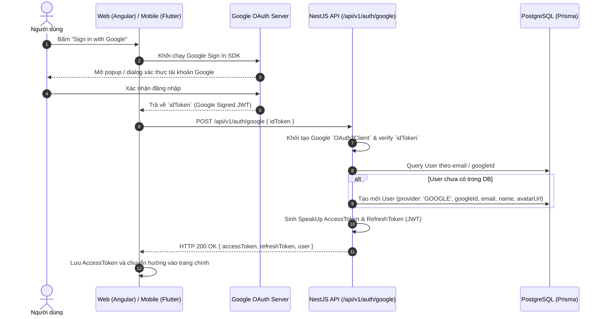

# 🔐 Tính năng Đăng nhập với Google (Google OAuth2 Authentication)

## 1. Mục đích
Tính năng cho phép người dùng đăng nhập hoặc đăng ký tài khoản mới trên hệ thống **SpeakUp** thông qua tài khoản Google trên cả nền tảng **Web (Angular)** và **Mobile (Flutter)**.

## 2. Luồng hoạt động (Sequence Diagram)



## 3. Chi tiết API & Data Model

### API Endpoint
- **Endpoint:** `POST /api/v1/auth/google`
- **Request Body:**
```json
{
  "idToken": "eyJhbGciOiJSUzI1NiIs..."
}
```
- **Response Success (200 OK):**
```json
{
  "success": true,
  "statusCode": 200,
  "message": "Đăng nhập thành công",
  "data": {
    "accessToken": "eyJhbGciOiJIUzI1Ni...",
    "refreshToken": "eyJhbGciOiJIUzI1Ni...",
    "user": {
      "id": "usr_123456",
      "email": "user@example.com",
      "name": "Nguyễn Văn A",
      "avatarUrl": "https://lh3.googleusercontent.com/a/...",
      "provider": "GOOGLE"
    }
  }
}
```

### Prisma Data Schema (`User` Model)
```prisma
model User {
  id        String   @id @default(uuid())
  email     String   @unique
  name      String?
  avatarUrl String?
  googleId  String?  @unique
  provider  Provider @default(LOCAL)
  createdAt DateTime @default(now())
  updatedAt DateTime @updatedAt
}

enum Provider {
  LOCAL
  GOOGLE
}
```

## 4. Trường hợp đặc biệt & Xử lý lỗi (Edge Cases)
- **Token không hợp lệ / Hết hạn:** Backend trả về `401 Unauthorized` với message `"Invalid or expired Google Token"`.
- **User đã tồn tại với Provider `LOCAL`:** Nếu email đã đăng ký bằng mật khẩu thường, Backend sẽ tự động liên kết `googleId` và nâng cấp tài khoản sang hỗ trợ Google Auth.
