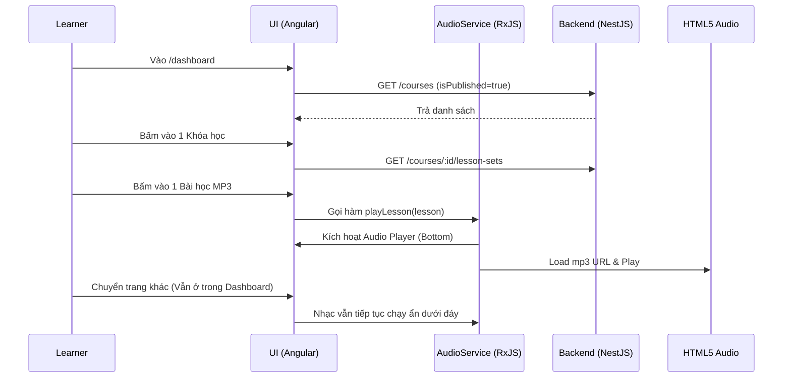

# Learner Audio Player & Dashboard (Phase 2.2)

## 1. Mô tả chung (Overview)
- **Mục tiêu:** Xây dựng không gian học tập cho Học viên. Tại đây, Học viên có thể xem các khóa học đang được Public, chọn bài học và luyện nghe MP3 thông qua một trình phát nhạc chuyên dụng.
- **Phạm vi (Scope):**
  - Giao diện danh sách Khóa học (`/dashboard/courses`).
  - Giao diện chi tiết Bộ bài học (`/dashboard/courses/:id`).
  - Component Audio Player (Global, Sticky Bottom).
  - Tích hợp RxJS Service để giữ nhạc không bị ngắt khi chuyển trang.
- **Đối tượng (Actors):** Học viên (Learner).

## 2. Luồng nghiệp vụ (User Flow)

## 3. Phân tích thiết kế (Technical Design)

### 3.1. Thiết kế Giao diện (Frontend)
- **Các Component cần xây dựng:**
  - `LearnerCourseListComponent`: Hiển thị dạng Card Grid đẹp mắt.
  - `LearnerCourseDetailComponent`: Hiển thị dạng Accordion (Bộ bài học -> Bài học). Có nút "Nghe Audio".
  - `AudioPlayerComponent`: Nằm ở `shared/components/audio-player`. Sử dụng `position: fixed; bottom: 0;`.
- **State Management (AudioService):**
  - Dùng `BehaviorSubject<Lesson | null>` để lưu thông tin bài học đang phát.
  - Dùng `HTMLAudioElement` để điều khiển (play, pause, currentTime, playbackRate).
- **Routing:** 
  - `/dashboard` -> Danh sách khóa học.
  - `/dashboard/courses/:id` -> Chi tiết khóa học.

### 3.2. Thiết kế API (Backend)
- Đã hoàn thiện từ Phase 2.1 (Admin). Chúng ta tái sử dụng API GET Courses và GET Lesson Sets.
- Có thể cần cập nhật API GET Courses để chỉ trả về khóa học `isPublished = true` đối với User thông thường (role LEARNER). 

## 4. Thiết kế Cơ sở dữ liệu (Database Schema)
(Tái sử dụng các bảng Course, LessonSet, Lesson). Không thay đổi CSDL trong Phase này.

## 5. Xử lý ngoại lệ (Edge Cases & Error Handling)
- **File MP3 lỗi / không tồn tại:** Bắt sự kiện `onerror` của thẻ `<audio>` để thông báo "Không thể tải Audio".
- **Responsive:** Audio Player phải thu gọn trên Mobile, chỉ hiện nút Play/Pause và Tên bài học. Trên Desktop hiện đầy đủ Seek bar, Tốc độ, Âm lượng.
- **Audio bị gián đoạn:** Lưu lại `currentTime` vào LocalStorage mỗi 5s để khôi phục nếu người dùng lỡ tắt trình duyệt (Tính năng nâng cao, có thể làm ở Phase 3).
