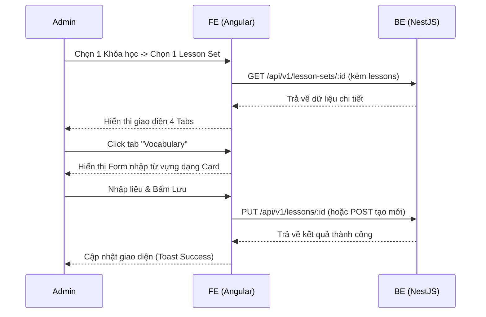

# Giao diện Quản lý Bài học chuyên biệt (Lesson Set Manager)

## 1. Mô tả chung (Overview)
- **Mục tiêu:** Tính năng này giải quyết vấn đề quản lý nội dung học tập một cách trực quan, tối ưu cho phương pháp học tiếng Anh (như Effortless English). Việc tách biệt UI cho từng loại bài học giúp Admin nhập liệu nhanh, chính xác và không bị rối.
- **Phạm vi (Scope):** 
  - Giao diện Admin: Quản lý chi tiết một Lesson Set.
  - Phân tách thành 4 tab/màn hình chuyên biệt: Main Article, Vocabulary, Mini Stories, Point of View (POV).
  - Tích hợp các form nhập liệu phù hợp với từng loại (Rich Text cho Main, Card/Grid cho Vocab, Timeline cho Mini Story).
- **Đối tượng (Actors):** Admin

## 2. Luồng nghiệp vụ (User Flow)



## 3. Phân tích thiết kế (Technical Design)

### 3.1. Thiết kế Giao diện (Frontend)
- **Các Component cần xây dựng/chỉnh sửa:**
  - `LessonSetManagerComponent` (Trang chính, chứa 4 tabs)
  - `MainArticleFormComponent` (Có Quill Editor và file upload mp3)
  - `VocabFormComponent` (Giao diện Card cho từ vựng)
  - `MiniStoryListFormComponent` (Danh sách các câu chuyện)
  - `MiniStoryFormComponent` (Editor nhập Timeline và lời thoại)
  - `PovFormComponent` (Upload mp3 và title)
- **State Management:** Dữ liệu chi tiết của Lesson Set sẽ được fetch 1 lần và quản lý state tại Component cha (`LessonSetManagerComponent`), truyền xuống các tab qua `@Input()`.
- **Routing:** `/admin/courses/:courseId/sets/:setId`

### 3.2. Thiết kế API (Backend)
- Hệ thống API hiện tại đã hỗ trợ CRUD cho Lesson và Transcript.
- **Các API Endpoints chính:**
  - `GET /api/v1/lesson-sets/:id` (kèm lessons & transcripts)
  - `POST /api/v1/lessons` (Tạo lesson mới theo type)
  - `PUT /api/v1/lessons/:id` (Cập nhật lesson và upsert transcripts)
  - `DELETE /api/v1/lessons/:id`

## 4. Thiết kế Cơ sở dữ liệu (Database Schema)
Schema hiện tại đã hoàn toàn tương thích và không cần chỉnh sửa thêm.

```mermaid
erDiagram
    LESSON_SET ||--o{ LESSON : contains
    LESSON ||--o{ TRANSCRIPT : has
    LESSON {
        string id PK
        string lessonSetId FK
        string type (MAIN, VOCAB, MINI_STORY, POV)
        string audioUrl
    }
    TRANSCRIPT {
        string id PK
        string lessonId FK
        float startTime
        float endTime
        string textContent
    }
```

## 5. Xử lý ngoại lệ (Edge Cases & Error Handling)
- **Quản lý giới hạn:** Main Article, Vocab, POV chỉ được phép có 1 Lesson trong 1 Set. Nếu đã có thì nút "Tạo mới" bị ẩn, chuyển sang giao diện "Sửa".
- **Mini Story:** Được phép tạo nhiều bài, cần có UI quản lý danh sách (thêm, sửa, xóa thứ tự).

## 6. Checklist (Definition of Done)
- [x] Phân tích thiết kế xong
- [x] Thiết kế Database (Đã hoàn thiện ở phase trước)
- [ ] Code UI 4 tabs (LessonSetManager)
- [ ] Code Component Main Article
- [ ] Code Component Vocabulary
- [ ] Code Component Mini Story
- [ ] Code Component POV
- [ ] Ghép nối hoàn thiện & Kiểm thử
