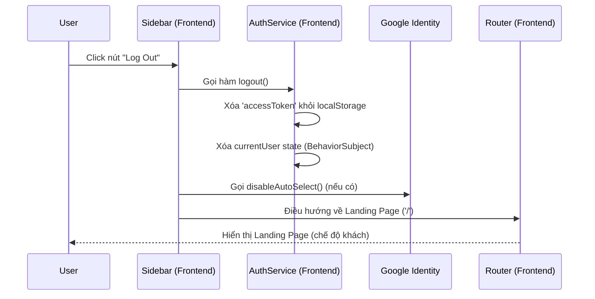

# Đăng xuất (Logout)

## 1. Mô tả chung (Overview)
- **Mục tiêu:** Tính năng này cho phép người dùng (học viên) thoát khỏi phiên làm việc hiện tại, xóa bỏ mọi dữ liệu nhạy cảm (JWT Token) trên trình duyệt để bảo mật tài khoản.
- **Phạm vi (Scope):** Xóa Token, điều hướng người dùng về trang chủ (Landing Page), và ngắt kết nối Auto-select của Google Auth.
- **Đối tượng (Actors):** Người dùng đã đăng nhập.

## 2. Luồng nghiệp vụ (User Flow)

## 3. Phân tích thiết kế (Technical Design)

### 3.1. Thiết kế Giao diện (Frontend)
- **Các Component cần xây dựng/chỉnh sửa:** `SidebarComponent` (Thêm sự kiện click), `AuthService` (Kiểm tra lại logic logout).
- **State Management:** Gọi `currentUserSubject.next(null)` để làm mới trạng thái trên toàn ứng dụng.
- **Routing:** Chuyển hướng về root `/`.

### 3.2. Thiết kế API (Backend)
- **Các API Endpoints:** (Không yêu cầu). Kiến trúc Authentication của dự án sử dụng Stateless JWT Token. Do đó, việc đăng xuất chỉ cần xóa Token ở phía Client (Trình duyệt) là đủ. Không cần tốn tài nguyên gọi API Backend.

## 4. Thiết kế Cơ sở dữ liệu (Database Schema)
- (Không yêu cầu)

## 5. Xử lý ngoại lệ (Edge Cases & Error Handling)
- **Trường hợp Token đã hết hạn:** Dù Token hợp lệ hay không, thao tác nhấn Log Out vẫn ép xóa mọi rác dữ liệu ở `localStorage` và đẩy về trang chủ thành công.

## 6. Checklist (Definition of Done)
- [x] Phân tích thiết kế xong
- [x] Code Frontend UI (gắn sự kiện click)
- [x] Xử lý logic xóa Token và State
- [x] Tích hợp Google `disableAutoSelect()`
- [x] Điều hướng thành công về Landing Page
