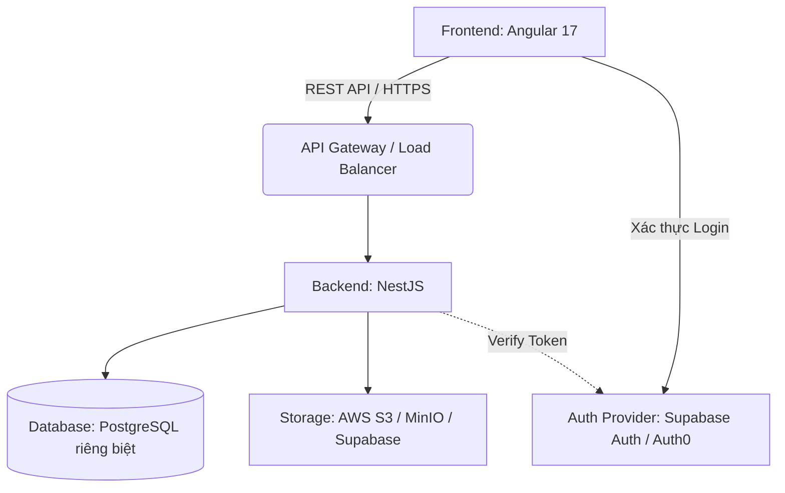

# Software Architecture Document

## 1. Kiến trúc Tổng thể (High-level Architecture)
Hệ thống SpeakUp sử dụng kiến trúc **Client-Server** với sự phân tách rạch ròi giữa Auth (Xác thực) và Database (Lưu trữ), giúp dễ dàng test và thay đổi dịch vụ khi cần.

## 2. Công nghệ sử dụng (Technology Stack)
- **Frontend:** Angular 17 (Standalone Components, SCSS, RxJS).
- **Backend:** NestJS (TypeScript, Express).
- **Database:** PostgreSQL (Có thể dùng Docker chạy Local để test, hoặc host riêng).
- **Authentication:** Supabase Auth (hoặc Firebase/Auth0) hoạt động như một dịch vụ độc lập (Identity Provider).
- **ORM:** Prisma (Giúp quản lý và query Database cực kỳ an toàn).

## 3. Frontend Architecture (Angular)
- Cấu trúc thư mục theo tính năng (Feature-based structure).
- Các thành phần chính:
  - `components/`: Các UI component dùng chung (Sidebar, Topbar).
  - `pages/`: Các component đại diện cho một trang (Dashboard, LessonPlayer).
  - `services/`: Quản lý call API và State Management.
  - `guards/`: Route guards để bảo vệ các trang yêu cầu Login.

## 4. Backend Architecture (NestJS)
- Áp dụng mô hình **Controller-Service-Repository**.
  - `Controllers`: Tiếp nhận HTTP requests, xử lý routing.
  - `Services`: Chứa Business Logic cốt lõi (Tính toán tiến độ, xử lý transcript).
  - `Repositories/Prisma`: Tương tác trực tiếp với Database.

## 5. Database Schema (Lược đồ CSDL)
- **Users:** `id`, `email`, `full_name`, `avatar`, `created_at`.
- **Courses:** `id`, `title`, `description`, `level`, `thumbnail`.
- **Lesson_Sets:** `id`, `course_id`, `title`, `order_index`.
- **Lessons:** `id`, `lesson_set_id`, `type`, `audio_url`, `transcript_json`.
- **User_Progress:** `id`, `user_id`, `lesson_id`, `status`, `last_position`, `updated_at`.
