# Phân tích & Thiết kế Module Auth

Tài liệu này mô tả chi tiết luồng xác thực (Authentication Flow) và đồng bộ dữ liệu người dùng giữa Frontend (Angular), Identity Provider (Supabase) và Backend (NestJS).

## 1. Vấn đề cốt lõi
Hệ thống SpeakUp không lưu trữ mật khẩu của người dùng. Việc đăng nhập/đăng ký được giao phó hoàn toàn cho **Supabase Auth**.
Tuy nhiên, hệ thống Backend (NestJS) cần có dữ liệu (ID, Email) của người dùng lưu trong Database Local (PostgreSQL) để có thể tạo các bản ghi liên quan như: Tiến độ học tập (`progress`), Bài học đã mở khóa, v.v.

Do đó, chúng ta cần một cơ chế **Đồng bộ User (Sync User)**.

## 2. Sequence Diagram (Sơ đồ luồng hoạt động)

Sơ đồ dưới đây mô tả chính xác những gì xảy ra khi một người dùng mở ứng dụng và Đăng nhập.

```mermaid
sequenceDiagram
    autonumber
    actor User as Người dùng
    participant FE as Angular (Frontend)
    participant Supa as Supabase Auth
    participant BE as NestJS (Backend)
    participant DB as PostgreSQL (Local)

    User->>FE: Bấm Đăng nhập (Google / Email)
    FE->>Supa: Gửi request Đăng nhập
    Supa-->>FE: Trả về [Access Token (JWT)] & Thông tin User
    
    note over FE, BE: Bắt đầu luồng Đồng bộ (Sync)
    FE->>BE: POST /auth/sync (Kèm Header: Bearer [JWT])
    
    rect rgb(30, 30, 30)
        note over BE: JwtAuthGuard hoạt động
        BE->>BE: Giải mã & Xác thực JWT hợp lệ?
    end

    alt JWT Hợp lệ
        BE->>DB: Upsert (Cập nhật hoặc Tạo mới) bản ghi User vào DB
        DB-->>BE: Thành công
        BE-->>FE: HTTP 200 OK (Đồng bộ thành công)
        FE-->>User: Chuyển hướng vào trang Dashboard
    else JWT Hết hạn / Giả mạo
        BE-->>FE: HTTP 401 Unauthorized
        FE-->>User: Báo lỗi, yêu cầu đăng nhập lại
    end
```



## 3. Kiến trúc Triển khai (Implementation Details)

### 3.1. Phía Frontend (Angular)
- Sử dụng `@supabase/supabase-js` để gọi hàm `signInWithOAuth()` hoặc `signInWithPassword()`.
- Lắng nghe sự kiện `onAuthStateChange`. Nếu trạng thái là `SIGNED_IN`, lập tức gọi API `/auth/sync` của Backend.

### 3.2. Phía Backend (NestJS)
Được chia làm 2 phần độc lập:

**Phần 1: Cấu hình Bảo vệ (Guard)**
- **Vị trí:** `src/core/guards/jwt-auth.guard.ts` và `src/core/strategies/jwt.strategy.ts`
- **Công nghệ:** Sử dụng `passport-jwt`.
- **Nhiệm vụ:** Trích xuất Token từ Header, giải mã bằng `SUPABASE_KEY` (hoặc cấu hình JWKS của Supabase) để lấy ra `sub` (chính là `auth_provider_id`).

**Phần 2: Logic Đồng bộ (Sync Controller)**
- **Vị trí:** `src/modules/auth/auth.controller.ts`
- **Nhiệm vụ:** Cung cấp Endpoint `POST /auth/sync`. API này phải được bảo vệ bởi `@UseGuards(JwtAuthGuard)`.
- Khi API được gọi, nó sẽ trích xuất thông tin user từ Token (hoặc Body) và gọi `AuthService` để dùng Prisma thực hiện lệnh `upsert` vào bảng `users`.

## 4. Cấu trúc bảng Database (`users`)
```prisma
model User {
  id               String   @id @default(uuid())
  auth_provider_id String   @unique // Trỏ tới UID của Supabase Auth
  email            String   @unique
  full_name        String
  avatar_url       String?
  // ...
}
```
