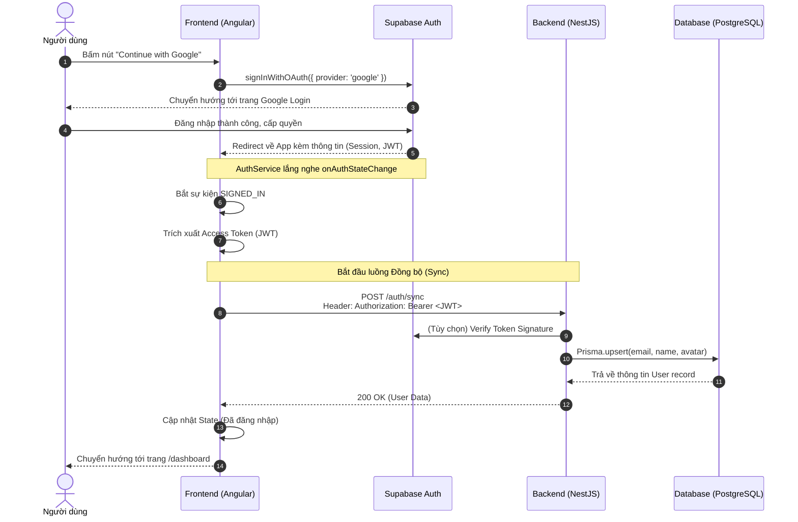

# Frontend Auth Integration Design

Tài liệu thiết kế chi tiết quá trình tích hợp xác thực (Authentication) trên Frontend (Angular 17) với Supabase và NestJS Backend.

## 1. Tổng quan Kiến trúc (Architecture Overview)

Hệ thống sử dụng kiến trúc **Delegated Authentication** (Xác thực ủy quyền):
- **Frontend (Angular)** chịu trách nhiệm hiển thị giao diện đăng nhập (Login UI).
- **Supabase** đóng vai trò là Identity Provider (IdP) xử lý OAuth (Google) và cấp phát JWT.
- **Backend (NestJS)** đóng vai trò là Resource Server, nhận JWT từ Frontend để định danh người dùng và lưu trữ thông tin cơ sở dữ liệu.

## 2. Luồng xử lý Đăng nhập (Sequence Diagram)

Dưới đây là Sequence Diagram minh họa luồng xử lý từ lúc người dùng bấm nút đăng nhập tới khi hệ thống đồng bộ xong dữ liệu.

## 3. Các Thành phần Cốt lõi trên Angular

Để thực hiện luồng trên, Frontend cần phát triển 4 thành phần chính:

### 3.1. Supabase Client Setup
Sử dụng SDK chính thức `@supabase/supabase-js`.
- Cấu hình biến môi trường trong `src/environments/environment.ts`.
- Yêu cầu 2 thông số: `SUPABASE_URL` và `SUPABASE_ANON_KEY`.

### 3.2. AuthService (`src/app/core/services/auth.service.ts`)
Là Service Singleton chịu trách nhiệm giao tiếp trực tiếp với Supabase và Backend.
Các hàm chính:
- `signInWithGoogle()`: Gọi Supabase OAuth.
- `signOut()`: Xóa phiên đăng nhập nội bộ và trên Supabase.
- `syncUserWithBackend()`: Hàm nội bộ được gọi khi có sự kiện `SIGNED_IN`, sử dụng `HttpClient` bắn POST request tới `/auth/sync`.

### 3.3. AuthInterceptor (`src/app/core/interceptors/auth.interceptor.ts`)
Sử dụng kiến trúc Functional Interceptor của Angular 17.
- **Nhiệm vụ**: Tự động chặn mọi HTTP Request gửi tới Backend (`localhost:3000`).
- **Xử lý**: Lấy JWT Token từ `AuthService` (hoặc LocalStorage) và gắn vào Header: `Authorization: Bearer <TOKEN>`.
- **Lợi ích**: Giúp code gọi API ở mọi nơi không cần quan tâm đến việc đính kèm Token thủ công.

### 3.4. AuthGuard (`src/app/core/guards/auth.guard.ts`)
Sử dụng Functional Guard `CanActivate`.
- Bảo vệ các Route riêng tư (Private Routes) như: `/dashboard`, `/explore`, `/lesson-player`.
- Trả về `true` nếu user đã đăng nhập.
- Nếu chưa đăng nhập, tự động điều hướng (Redirect) về `/auth` (Trang đăng nhập).

## 4. Xử lý Trạng thái UI (UI States)

Trang `AuthComponent` cần xử lý các trạng thái sau để tăng trải nghiệm người dùng (UX):
1. **Idle**: Hiển thị nút "Continue with Google" bình thường.
2. **Loading (Chờ Google)**: Sau khi bấm nút, nếu thiết bị chậm, hiển thị Spinner hoặc vô hiệu hóa (disable) nút bấm.
3. **Syncing (Chờ Backend)**: Sau khi Google trả về App, hiển thị trạng thái "Đang đồng bộ dữ liệu..." trong khoảng thời gian gọi API `/auth/sync`.
4. **Error**: Nếu API lỗi hoặc Google từ chối, hiển thị thông báo lỗi thân thiện (Toast/Snackbar) và cho phép người dùng thử lại.

## 5. Các bước triển khai tiếp theo
1. Thực thi việc cài đặt `@supabase/supabase-js`.
2. Tạo các files theo danh sách trên.
3. Gắn Data Binding vào Giao diện `auth.html`.
4. Bật chế độ chạy thử (ng serve) để test end-to-end (từ Click UI tới khi Database PostgreSQL ghi nhận User mới).
