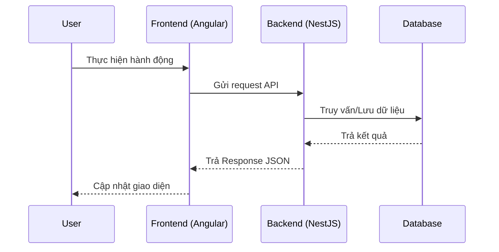
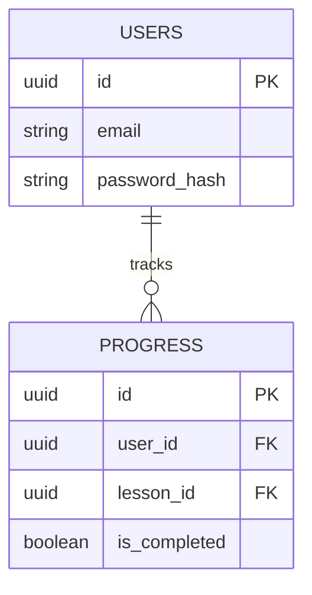

# [Tên Tính Năng]

## 1. Mô tả chung (Overview)
- **Mục tiêu:** Tính năng này giải quyết vấn đề gì? Mang lại giá trị gì cho người dùng (Học viên)?
- **Phạm vi (Scope):** Những yêu cầu nào nằm trong tính năng này, những phần nào sẽ để dành cho phase sau.
- **Đối tượng (Actors):** Người dùng chưa đăng nhập, Học viên, Admin...

## 2. Luồng nghiệp vụ (User Flow)
Mô tả các bước tương tác của người dùng. Có thể sử dụng Mermaid Sequence Diagram để vẽ luồng dữ liệu.

## 3. Phân tích thiết kế (Technical Design)

### 3.1. Thiết kế Giao diện (Frontend)
- **Các Component cần xây dựng/chỉnh sửa:** (Ví dụ: `LoginComponent`, `AudioPlayerComponent`)
- **State Management:** (Dữ liệu nào cần lưu ở Service/Store)
- **Routing:** (URL của trang này là gì?)

### 3.2. Thiết kế API (Backend)
- **Các API Endpoints:**
  - `GET /api/v1/danh-sach`: Mô tả ngắn gọn
  - `POST /api/v1/tao-moi`: Mô tả ngắn gọn
- **Services / Modules cần thêm:**

## 4. Thiết kế Cơ sở dữ liệu (Database Schema)
Định nghĩa các bảng, các trường dữ liệu và mối quan hệ giữa chúng.

## 5. Xử lý ngoại lệ (Edge Cases & Error Handling)
- **Trường hợp mất mạng / API lỗi:** Hệ thống hiện thông báo gì?
- **Trường hợp dữ liệu không hợp lệ:** Validate ở FE và BE ra sao?

## 6. Checklist (Definition of Done)
- [ ] Phân tích thiết kế xong
- [ ] Thiết kế Database
- [ ] Code Backend API & Test
- [ ] Code Frontend UI
- [ ] Ghép API vào Frontend
- [ ] Hoàn thành & Kiểm thử thành công
